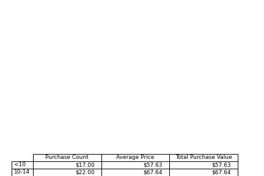
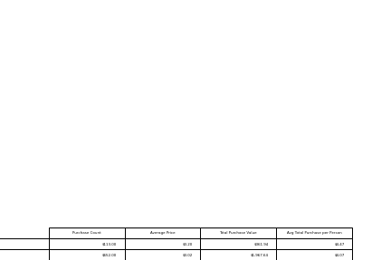
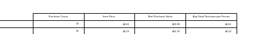

# **pandas-challenge**
# *Submitted by Nathan Putnam* 

## **Customer Age Summary** 

We can see that the majority of the purchases were made by users ages 20-24, with total purchasesof $790.39. 
We can also see that the age group 40+ had the least amount of purchases with only 12 purchases totalling only $36.45. 

## *Gender Summary** 

We can see that males have almost 6x more purchases than females.
Although males purchased more items, females have a higher average purchase price per item. 

**Recommendation:** Spend resources to determine how to obtain more female users due to their higher average purchase price. 

## *Gender Summary** 

Here we can determine which items sold the most

**Recommendation:** Detecate resources to determine why these top 5 items were the most sold
